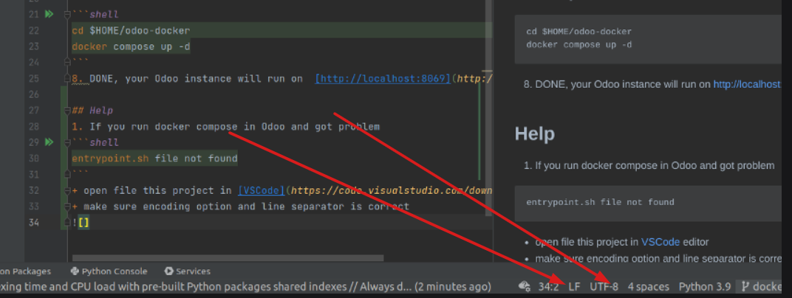

# Odoo's installation using Docker compose

## Requirements

- Git

- [Docker](https://docs.docker.com/engine/install/)

- [Docker compose plugin](https://docs.docker.com/compose/install/linux/)

- [Manage Docker as a non-root user](https://docs.docker.com/engine/install/)

- A local copy of the [xmars4/odoo-docker-compose repository](https://github.com/xmars4/odoo-docker-compose)

## Running Odoo

1. Copy custom addons to folder **[custom-addons](custom-addons/)**

1. Create a confile file named **odoo.conf** in folder **[etc/](etc/)**\
you can reference to the [sample file](etc/odoo.conf.sample)

1. Create a file named **password.txt** in folder **[postgresql/](postgresql/)** to store DB password

1. Running Odoo

    ```shell
    cd $ODOO_DOCKER_PATH
    docker compose up -d 
    ```

1. DONE, your Odoo instance will run on [http://localhost](http://localhost)

1. _(Optionally)_ Setup log rotate (on host machine)

    ```shell
    cd $ODOO_DOCKER_PATH/scripts
    sudo /bin/bash setup-logrotate.sh
    ```

1. _(Optionally)_ If you want running Odooo with extra commands, add _command_ param to **etc/odoo.conf** file

- For instance:

    - Update config file

        ```confile
        ...
        command = -d odoo_db -i stock -u sale_management
        ```

    - Restart services

        ```shell
        docker compose restart
        ```

## Tip and Tricks

- [generate records for testing](https://www.odoo.com/documentation/17.0/developer/reference/cli.html#database-population)

```shell
  docker exec <odoo_container_name_or_id> odoo populate --models res.partner,product.product --size medium -c /etc/odoo/odoo.conf
```

- run postgresql by docker

```shell
docker run --name postgresql-15 -p 5432:5432 \
 -e POSTGRES_USER=admin \
 -e POSTGRES_PASSWORD=admin \
 -e POSTGRES_DB=postgresdb \
 -d --restart unless-stopped \
 postgres:15
```

## Problems and Solutions

- Run multiple docker compose with the same config in the same folder name, the new one will override the others,

    \*\* Solution:

    [Specify a project name](https://docs.docker.com/engine/reference/commandline/compose/#use--p-to-specify-a-project-name) for each docker compose file to diffentiate them

- If you run docker compose in Windows and got problem

    ```shell
    entrypoint.sh file not found
    ```

    \*\* Solution:

    - open file this project in [VSCode](https://code.visualstudio.com/download)
        or [Pycharm](https://www.jetbrains.com/pycharm/download/)

    - make sure encoding option and line separator is correct

        
